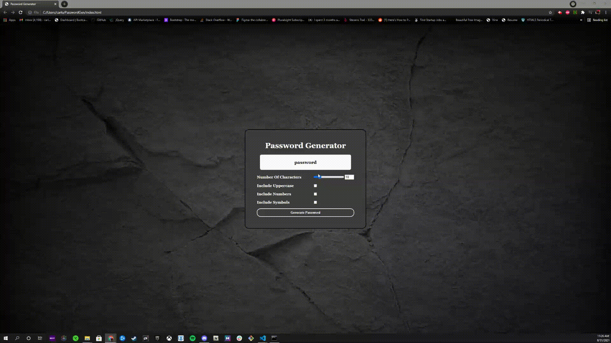

# Password Generator
This is a password generator that generates a random password depending on the user's input. It allows the user the select their desired character length (required) from 8 - 20 and choose their character type(s) (at least one required) from uppercase letters, lowercase letters, numbers, and special characters. It provides the user with a strong and secure password as a result.

## Usage
You can choose length of password from 8 - 20 characters

IF you checks include lowercase box, lowercase letters are added to generated password

IF you checks include uppercase box, uppercase letters are added to generated password

IF you checks include numbers box, numbers are added to the generated password

IF you checks include symbols box, symbols are added to the generated password

You can then copy custom password with the copy button

This is the [link](file:///Users/carlojoshuaserame/passgenerator/index.html) to the application.

## License

MIT License

Copyright (c) 2021 Carlo Joshua Serame

Permission is hereby granted, free of charge, to any person obtaining a copy
of this software and associated documentation files (the "Software"), to deal
in the Software without restriction, including without limitation the rights
to use, copy, modify, merge, publish, distribute, sublicense, and/or sell
copies of the Software, and to permit persons to whom the Software is
furnished to do so, subject to the following conditions:

The above copyright notice and this permission notice shall be included in all
copies or substantial portions of the Software.

THE SOFTWARE IS PROVIDED "AS IS", WITHOUT WARRANTY OF ANY KIND, EXPRESS OR
IMPLIED, INCLUDING BUT NOT LIMITED TO THE WARRANTIES OF MERCHANTABILITY,
FITNESS FOR A PARTICULAR PURPOSE AND NONINFRINGEMENT. IN NO EVENT SHALL THE
AUTHORS OR COPYRIGHT HOLDERS BE LIABLE FOR ANY CLAIM, DAMAGES OR OTHER
LIABILITY, WHETHER IN AN ACTION OF CONTRACT, TORT OR OTHERWISE, ARISING FROM,
OUT OF OR IN CONNECTION WITH THE SOFTWARE OR THE USE OR OTHER DEALINGS IN THE
SOFTWARE.

## Contact
Questions? please contact me!

Github: [CJSerame24](https://github.com/CJSerame24)

Email: [carloserame24@gmail.com](carloserame24@gmail.com)

